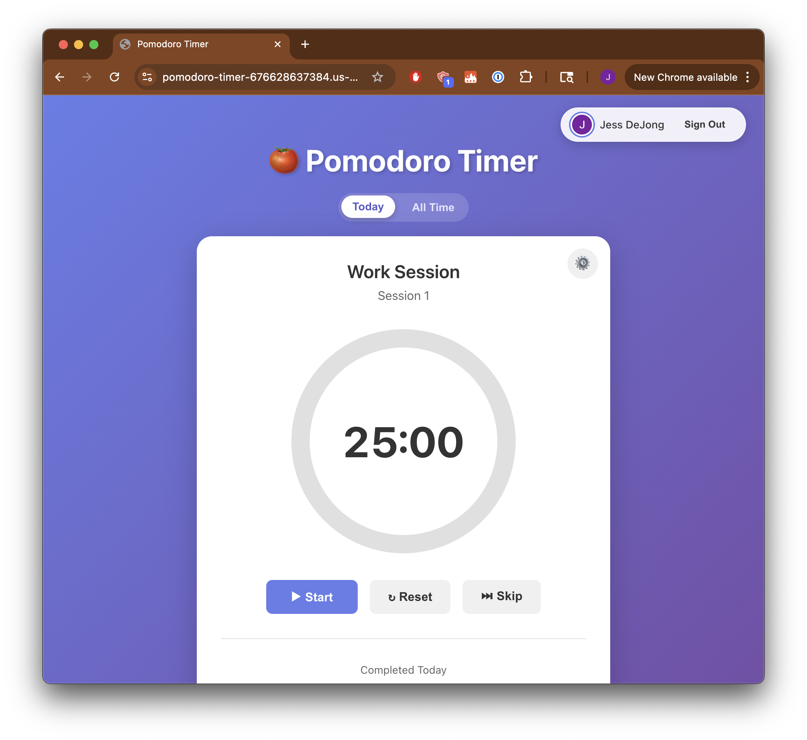

# Pomodoro Timer

A beautiful Pomodoro timer with Google authentication and Firestore history tracking.



## Features

- ⏱️ Customizable work/break sessions (default: 25min work, 5min break)
- 🔔 Browser notifications & sound alerts
- 🔐 Google authentication
- 📝 Log pomodoros with category and description
- 📊 View today's pomodoros and all-time history
- 💾 Settings persist in localStorage

## Quick Start

```bash
npm install
npm run dev
```

Create a `.env` file with your Firebase config (see [FIREBASE_AUTH_SETUP.md](./FIREBASE_AUTH_SETUP.md)):

```env
VITE_FIREBASE_API_KEY=your-api-key
VITE_FIREBASE_AUTH_DOMAIN=your-project.firebaseapp.com
VITE_FIREBASE_PROJECT_ID=your-project-id
VITE_FIREBASE_STORAGE_BUCKET=your-project.appspot.com
VITE_FIREBASE_MESSAGING_SENDER_ID=your-sender-id
VITE_FIREBASE_APP_ID=your-app-id
```

## Deployment

Deploy to Google Cloud Run:

```bash
gcloud builds submit --config cloudbuild.yaml
```

Make sure `.env.production` contains your Firebase config and add your Cloud Run domain to Firebase Auth authorized domains.

## Tech Stack

- React 18 + Vite
- Firebase Auth & Firestore
- Express.js (serving static files)
- Google Cloud Run

## License

MIT
